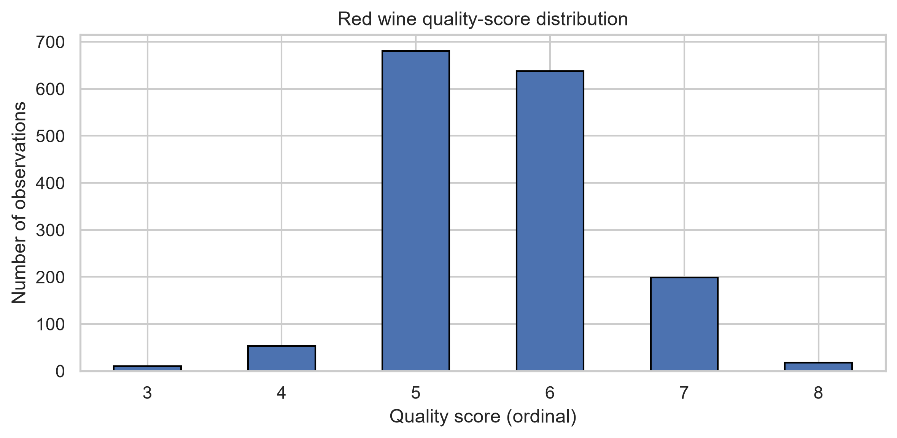
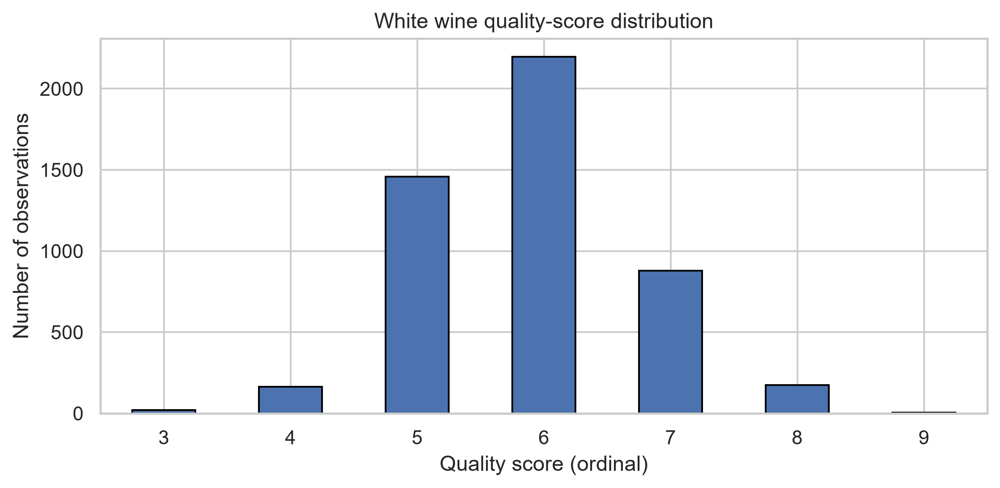
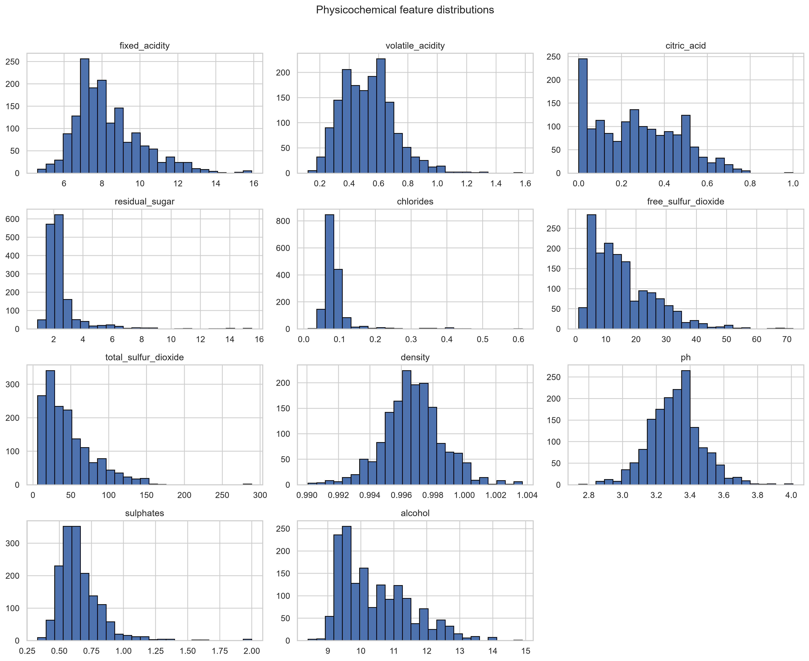
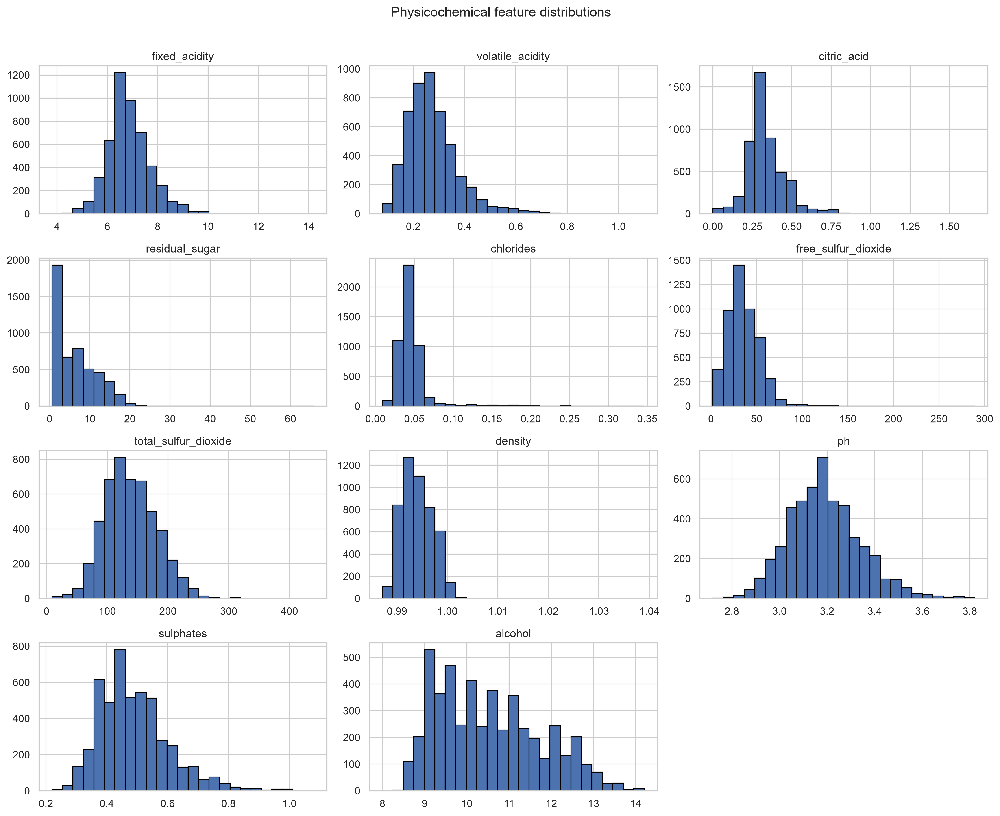
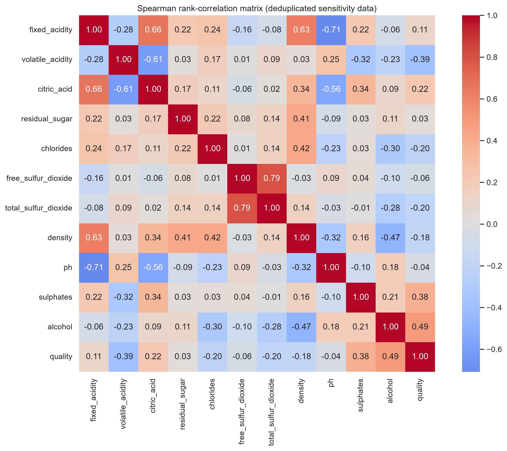
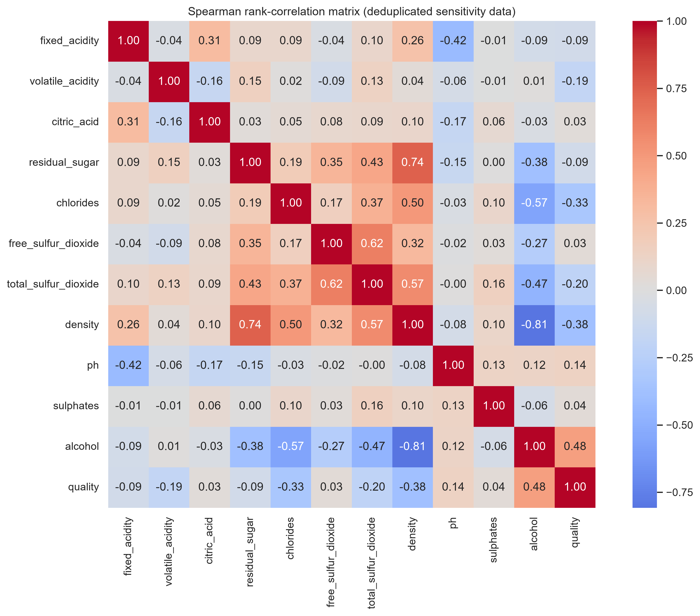
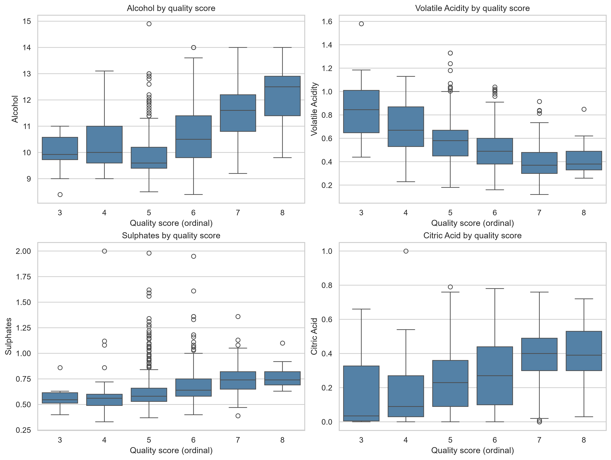
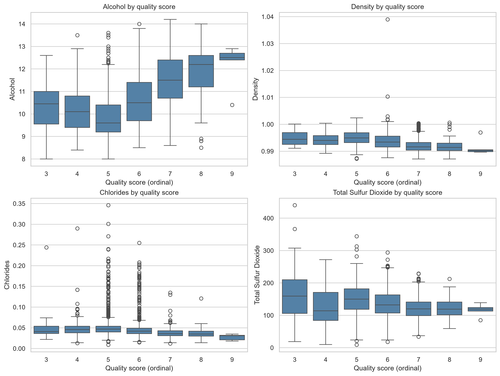

# Statistical Report: Red and White Wine Quality

**Report date:** 17 July 2026  
**Data source:** UCI Wine Quality datasets  
**Analysis population:** Exact-row deduplicated observations

## Executive summary

This report analyzes 1,359 distinct red-wine records and 3,961 distinct white-wine records after exact-row deduplication. Both datasets contain complete physicochemical measurements and expert quality scores, with no missing values. Exact duplicates represented 15.0% of the raw red dataset and 19.1% of the raw white dataset and were removed before the primary analysis. Distinct rows are not necessarily statistically independent wines.

Alcohol is the most consistent bivariate quality correlate in both wine types. It has the strongest positive monotonic association with quality (red Spearman rho = 0.488; white rho = 0.476), and the low-versus-high quality contrast is large in both datasets (Hedges' g = -0.998 for red and -0.925 for white, expressed as low minus high). Higher-quality wines therefore tend to contain more alcohol.

The remaining quality pattern differs by wine type. For red wine, volatile acidity and sulphates are prominent: quality decreases as volatile acidity rises and increases as sulphates rise. For white wine, density and chlorides are much more prominent: quality decreases as either rises. These are associations, not evidence that changing a single chemical measurement will cause a quality score to change.

Scores are shifted slightly upward in the white-wine dataset. The ordinal red-versus-white rank-biserial effect is -0.149 (negative means lower ranks for red), and Cramer's V for the score distribution is 0.132; both are small. A score of at least 6 occurred in 66.0% of distinct white-wine records and 52.9% of distinct red-wine records. This should not be interpreted as a universal ranking of white wine above red wine, because the datasets are observational and may represent different products, production processes, assessors, and sampling frames.

## 1. Study design and methods

The analysis uses eleven physicochemical features and the ordinal expert quality score. Column names were normalized, schemas and numeric types were validated, missingness was checked, and exact duplicate rows were removed. No observations were removed merely because they were extreme.

The principal methods were:

- Descriptive statistics for central tendency and dispersion.
- Spearman rank correlation for monotonic association with ordinal quality.
- A prespecified split of low quality (scores 3-5) and high quality (scores at least 6; observed scores 6-8 for red and 6-9 for white).
- Welch's independent-samples t-test for group mean comparisons.
- Hedges' g for standardized mean differences, using the conventional pooled standard deviation and small-sample correction alongside the unequal-variance Welch test. Signs are reported as the first group minus the second group.
- Mann-Whitney U, rank-biserial correlation, a chi-square homogeneity test, and Cramer's V for the ordinal red-versus-white quality comparison.
- Holm adjustment within each prespecified family to control the family-wise error rate at 0.05. The five families are red correlations (11 tests), white correlations (11), red low/high comparisons (11), white low/high comparisons (11), and red/white physicochemical comparisons (11). The two complementary red/white quality tests form a separate two-test family.

Absolute Hedges' g values around 0.2, 0.5, and 0.8 are conventionally described as small, medium, and large. These labels are only interpretive aids; practical importance depends on wine-production context and measurement units.

Correlation labels are likewise descriptive: absolute rho below 0.10 is called very weak, 0.10-0.29 weak, 0.30-0.49 moderate, and at least 0.50 strong. These thresholds are conventions rather than scientific boundaries.

## 2. Data quality and sample composition

| Dataset | Raw rows | Exact duplicates | Duplicate rate | Unique rows analyzed | Missing values |
|---|---:|---:|---:|---:|---:|
| Red wine | 1,599 | 240 | 15.0% | 1,359 | 0 |
| White wine | 4,898 | 937 | 19.1% | 3,961 | 0 |

Deduplication matters because repeated identical records can give observations excess weight and make standard errors artificially small. The results below therefore use only unique rows.

## 3. Quality-score distributions

| Quality score | Red count (%) | White count (%) |
|---:|---:|---:|
| 3 | 10 (0.7%) | 20 (0.5%) |
| 4 | 53 (3.9%) | 153 (3.9%) |
| 5 | 577 (42.5%) | 1,175 (29.7%) |
| 6 | 535 (39.4%) | 1,788 (45.1%) |
| 7 | 167 (12.3%) | 689 (17.4%) |
| 8 | 17 (1.3%) | 131 (3.3%) |
| 9 | 0 (0.0%) | 5 (0.1%) |

| Summary | Red wine | White wine |
|---|---:|---:|
| Mean quality | 5.623 | 5.855 |
| Standard deviation | 0.824 | 0.891 |
| Median | 6 | 6 |
| Interquartile range | 1 | 1 |
| Observed range | 3-8 | 3-9 |
| Proportion scoring at least 6 | 52.9% | 66.0% |

Means and standard deviations are included as familiar descriptive summaries, but the median, full distribution, and rank-based comparisons are primary because quality is ordinal.

The 95% Wilson confidence interval for the proportion scoring at least 6 is 50.2%-55.5% for red wine and 64.5%-67.4% for white wine. These intervals quantify binomial sampling uncertainty but do not correct for possible clustering by producer, vintage, or tasting panel.

The red-versus-white score distributions differ statistically (chi-square = 92.13, 5 df, Holm-adjusted p = 4.00e-18), but the association is small (Cramer's V = 0.132). Scores 8 and 9 were pooled for this test to avoid a sparse expected count; the minimum expected count is then 7.66. A Mann-Whitney comparison gives the same directional conclusion (U for red = 2,290,875; Holm-adjusted p = 4.00e-18; rank-biserial correlation = -0.149). Because score values are ordinal and the two datasets may not share the same sampling and judging process, these results describe dataset differences rather than an intrinsic quality advantage for white wine.

## 4. Physicochemical profiles

### 4.1 Red wine descriptive statistics

| Feature | Mean | Standard deviation | Median |
|---|---:|---:|---:|
| Fixed acidity | 8.3106 | 1.7370 | 7.9000 |
| Volatile acidity | 0.5295 | 0.1830 | 0.5200 |
| Citric acid | 0.2723 | 0.1955 | 0.2600 |
| Residual sugar | 2.5234 | 1.3523 | 2.2000 |
| Chlorides | 0.0881 | 0.0494 | 0.0790 |
| Free sulfur dioxide | 15.8933 | 10.4473 | 14.0000 |
| Total sulfur dioxide | 46.8260 | 33.4089 | 38.0000 |
| Density | 0.9967 | 0.0019 | 0.9967 |
| pH | 3.3098 | 0.1550 | 3.3100 |
| Sulphates | 0.6587 | 0.1707 | 0.6200 |
| Alcohol | 10.4323 | 1.0821 | 10.2000 |

### 4.2 White wine descriptive statistics

| Feature | Mean | Standard deviation | Median |
|---|---:|---:|---:|
| Fixed acidity | 6.8393 | 0.8669 | 6.8000 |
| Volatile acidity | 0.2805 | 0.1034 | 0.2600 |
| Citric acid | 0.3343 | 0.1224 | 0.3200 |
| Residual sugar | 5.9148 | 4.8616 | 4.7000 |
| Chlorides | 0.0459 | 0.0231 | 0.0420 |
| Free sulfur dioxide | 34.8892 | 17.2100 | 33.0000 |
| Total sulfur dioxide | 137.1935 | 43.1291 | 133.0000 |
| Density | 0.9938 | 0.0029 | 0.9935 |
| pH | 3.1955 | 0.1515 | 3.1800 |
| Sulphates | 0.4904 | 0.1135 | 0.4800 |
| Alcohol | 10.5894 | 1.2171 | 10.4000 |

The distribution plots show substantial skewness and outliers in several chemical measurements, particularly residual sugar, chlorides, and sulfur dioxide. This supports using rank correlation for quality association and cautions against relying on means alone.

## 5. Associations with quality

### 5.1 Red wine

| Rank | Feature | Spearman rho | Holm-adjusted p-value | Interpretation |
|---:|---|---:|---:|---|
| 1 | Alcohol | +0.488 | 3.6e-81 | Moderate positive |
| 2 | Volatile acidity | -0.387 | 6.5e-49 | Moderate negative |
| 3 | Sulphates | +0.381 | 4.0e-47 | Moderate positive |
| 4 | Citric acid | +0.219 | 2.2e-15 | Weak positive |
| 5 | Chlorides | -0.204 | 2.0e-13 | Weak negative |
| 6 | Total sulfur dioxide | -0.197 | 1.6e-12 | Weak negative |
| 7 | Density | -0.184 | 3.8e-11 | Weak negative |
| 8 | Fixed acidity | +0.112 | 1.5e-4 | Weak positive |
| 9 | Free sulfur dioxide | -0.059 | 0.091 | Not significant after adjustment |
| 10 | pH | -0.043 | 0.230 | Not significant after adjustment |
| 11 | Residual sugar | +0.026 | 0.340 | Not significant after adjustment |

Red-wine quality is most clearly associated with higher alcohol, lower volatile acidity, and higher sulphates. Eight of eleven features remain statistically significant after Holm adjustment, although several effects are weak.

### 5.2 White wine

| Rank | Feature | Spearman rho | Holm-adjusted p-value | Interpretation |
|---:|---|---:|---:|---|
| 1 | Alcohol | +0.476 | 7.8e-222 | Moderate positive |
| 2 | Density | -0.383 | 1.7e-137 | Moderate negative |
| 3 | Chlorides | -0.333 | 2.7e-102 | Moderate negative |
| 4 | Total sulfur dioxide | -0.203 | 4.7e-37 | Weak negative |
| 5 | Volatile acidity | -0.185 | 4.1e-31 | Weak negative |
| 6 | pH | +0.136 | 4.4e-17 | Weak positive |
| 7 | Fixed acidity | -0.094 | 1.4e-8 | Very weak negative |
| 8 | Residual sugar | -0.092 | 2.2e-8 | Very weak negative |
| 9 | Sulphates | +0.036 | 0.075 | Not significant after adjustment |
| 10 | Free sulfur dioxide | +0.033 | 0.081 | Not significant after adjustment |
| 11 | Citric acid | +0.030 | 0.081 | Not significant after adjustment |

White-wine quality is most clearly associated with higher alcohol, lower density, and lower chlorides. Eight of eleven features remain statistically significant after adjustment, but associations below the first three are weak.

## 6. Low-versus-high quality comparisons

The low-quality group contains scores 3-5; the high-quality group contains scores at least 6 (observed as 6-8 for red and 6-9 for white). Hedges' g is calculated as low minus high, so a negative value means the feature is higher in the high-quality group.

### 6.1 Red wine: 640 low-quality and 719 high-quality records

| Feature | Low mean | High mean | Hedges' g | Holm p-value |
|---|---:|---:|---:|---:|
| Alcohol | 9.9208 | 10.8876 | -0.998 | 2.0e-68 |
| Volatile acidity | 0.5929 | 0.4730 | +0.693 | 1.0e-33 |
| Total sulfur dioxide | 55.1461 | 39.4200 | +0.484 | 5.7e-17 |
| Sulphates | 0.6205 | 0.6927 | -0.433 | 5.3e-14 |
| Density | 0.9970 | 0.9964 | +0.343 | 1.5e-9 |
| Citric acid | 0.2375 | 0.3033 | -0.341 | 2.4e-9 |
| Chlorides | 0.0941 | 0.0828 | +0.232 | 1.6e-4 |
| Fixed acidity | 8.1417 | 8.4609 | -0.184 | 0.0025 |
| Free sulfur dioxide | 16.6594 | 15.2114 | +0.139 | 0.033 |
| Residual sugar | 2.5268 | 2.5204 | +0.005 | 1.000 |
| pH | 3.3090 | 3.3105 | -0.009 | 1.000 |

The largest red-wine separation is alcohol, followed by volatile acidity. Total sulfur dioxide and sulphates show moderate standardized differences. Residual sugar and pH do not meaningfully separate the two groups.

### 6.2 White wine: 1,348 low-quality and 2,613 high-quality records

| Feature | Low mean | High mean | Hedges' g | Holm p-value |
|---|---:|---:|---:|---:|
| Alcohol | 9.9092 | 10.9403 | -0.925 | 3.0e-178 |
| Density | 0.9950 | 0.9932 | +0.644 | 3.3e-83 |
| Volatile acidity | 0.3127 | 0.2639 | +0.483 | 4.3e-38 |
| Chlorides | 0.0521 | 0.0427 | +0.414 | 1.0e-25 |
| Total sulfur dioxide | 147.4559 | 131.8993 | +0.366 | 4.4e-23 |
| Residual sugar | 6.6562 | 5.5324 | +0.232 | 1.5e-10 |
| pH | 3.1736 | 3.2068 | -0.220 | 1.8e-10 |
| Fixed acidity | 6.9566 | 6.7789 | +0.206 | 1.1e-8 |
| Sulphates | 0.4818 | 0.4947 | -0.114 | 0.0010 |
| Citric acid | 0.3325 | 0.3353 | -0.023 | 1.000 |
| Free sulfur dioxide | 34.7986 | 34.9359 | -0.008 | 1.000 |

The largest white-wine separation is again alcohol, followed by density. Volatile acidity, chlorides, and total sulfur dioxide show small-to-moderate differences. Citric acid and free sulfur dioxide do not separate the groups.

## 7. Direct comparison of red and white wines

The following Welch comparisons use red minus white for Hedges' g. All listed p-values are Holm-adjusted across the eleven physicochemical comparisons. Quality is intentionally excluded from this table because it is ordinal and is analyzed with rank- and distribution-based methods in Section 3.

| Feature | Red mean | White mean | Hedges' g | Holm p-value | Larger mean |
|---|---:|---:|---:|---:|---|
| Total sulfur dioxide | 46.8260 | 137.1935 | -2.211 | <1e-300 | White |
| Volatile acidity | 0.5295 | 0.2805 | +1.936 | <1e-300 | Red |
| Chlorides | 0.0881 | 0.0459 | +1.322 | 3.1e-159 | Red |
| Sulphates | 0.6587 | 0.4904 | +1.290 | 5.0e-194 | Red |
| Fixed acidity | 8.3106 | 6.8393 | +1.276 | 2.4e-156 | Red |
| Free sulfur dioxide | 15.8933 | 34.8892 | -1.205 | <1e-300 | White |
| Density | 0.9967 | 0.9938 | +1.090 | <1e-300 | Red |
| Residual sugar | 2.5234 | 5.9148 | -0.798 | 9.0e-300 | White |
| pH | 3.3098 | 3.1955 | +0.750 | 5.9e-110 | Red |
| Citric acid | 0.2723 | 0.3343 | -0.429 | 7.8e-27 | White |
| Alcohol | 10.4323 | 10.5894 | -0.133 | 8.2e-6 | White |

The wine types have strongly different chemical profiles. White wine has far more total and free sulfur dioxide and more residual sugar. Red wine has substantially more volatile acidity, chlorides, sulphates, fixed acidity, density, and a higher pH. Alcohol differs only slightly despite being statistically significant in this large sample.

Statistical significance is expected for many comparisons because of the sample sizes. The standardized effects show which physicochemical differences are substantial: most are large, whereas the alcohol difference is small. The ordinal quality difference is also small by rank-biserial correlation and Cramer's V.

## 8. Key similarities and differences in quality relationships

### Shared findings

1. **Alcohol is the leading positive quality marker in both datasets.** Its correlations and group effect sizes are remarkably similar across red and white wines.
2. **Higher volatile acidity tends to accompany lower quality.** The relationship is stronger for red wine, but it is present in both.
3. **Higher total sulfur dioxide tends to accompany lower quality.** This is a weak monotonic relationship in both datasets and a clearer low/high group difference.
4. **Higher-quality groups have lower average density and chlorides.** These differences occur for both wine types, although they are much stronger for white wine.
5. **Most relationships are moderate or weak.** No individual feature determines quality, and the physicochemical measurements are interrelated.

### Distinctive red-wine findings

- Sulphates are a major positive quality correlate in red wine (rho = 0.381) but have almost no monotonic relationship with white-wine quality (rho = 0.036).
- Volatile acidity is the second strongest red-wine quality correlate (rho = -0.387), with a medium-to-large low/high effect (g = 0.693).
- Citric acid has a weak positive relationship with red-wine quality but no meaningful white-wine relationship.
- Residual sugar and pH provide essentially no low/high discrimination for red wine.

### Distinctive white-wine findings

- Density is the second strongest white-wine quality correlate (rho = -0.383) and has a medium-to-large low/high effect (g = 0.644).
- Chlorides are the third strongest white-wine quality correlate (rho = -0.333), noticeably stronger than in red wine.
- Residual sugar and fixed acidity have weak negative quality associations in white wine, whereas their red-wine relationships are negligible or point in the opposite direction.
- White-wine pH has a weak positive relationship with quality; red-wine pH has no meaningful relationship.

## 9. Conclusions

The strongest general conclusion is that higher-quality wines in both datasets tend to have higher alcohol. Beyond alcohol, red-wine quality is characterized most by lower volatile acidity and higher sulphates, while white-wine quality is characterized most by lower density and lower chlorides.

The two wine classes are chemically distinct. White wines contain much more sulfur dioxide and residual sugar, while red wines contain more volatile acidity, chlorides, sulphates, fixed acidity, and have greater density and pH. The white-wine dataset has a greater proportion scoring at least 6 and slightly higher score ranks, but this distributional difference is small relative to the chemical differences between the wine types.

These results support treating red and white wines separately in any predictive model. A pooled model should include wine type and interactions between wine type and chemical features; otherwise, it may incorrectly assume that a feature has the same relationship with quality in both classes.

## 10. Limitations

- The data are observational, so associations cannot establish causation.
- Quality is an ordinal expert score. It is used only to define groups for Welch comparisons of continuous physicochemical features; direct quality-score comparisons use ordinal/distributional methods.
- The low/high threshold is a project convention, not a naturally validated cutoff.
- Confidence intervals in the notebooks are pointwise 95% intervals and are not multiplicity-adjusted; Holm correction applies to the reported hypothesis-test p-values.
- Exact duplicate removal prevents identical rows from receiving repeated weight, but some duplicates could represent genuinely separate wines with the same measurements.
- Deduplication does not establish independence among the remaining records; unobserved clustering could make conventional standard errors too small.
- The datasets do not provide enough contextual information here to control for producer, vintage, region, grape variety, or tasting panel.
- Multiple physicochemical features are correlated; bivariate results do not isolate independent effects.
- Very small p-values reflect both genuine separation and large sample sizes. Effect sizes and domain relevance should guide practical interpretation.
- Spearman and Mann-Whitney p-values use their standard large-sample approximations in the presence of tied ordinal quality scores.
- Conclusions apply to these Portuguese vinho verde samples and should not be generalized automatically to all red and white wines.

## Reproducibility

The detailed analyses are implemented in `notebooks/RED_WINE_ANALYSIS.ipynb` and `notebooks/WHITE_WINE_ANALYSIS.ipynb`. Deduplicated datasets are generated under `data/processed`, shared statistical functions are stored under `src`, and all figures referenced in this report are stored under `reports/figures`.
